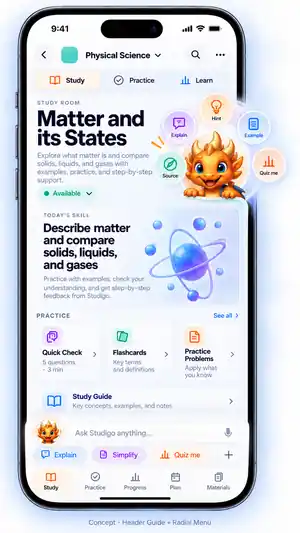
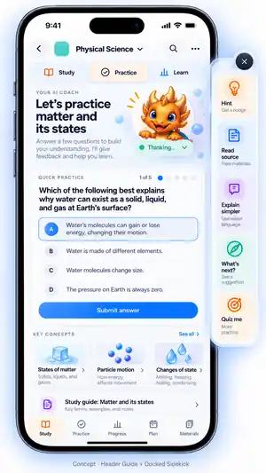

# Future Features

This file is Studigo's parking lot for product ideas that are worth preserving but are **not yet canonical product behavior**.

Do not implement items in this document automatically. When a concept is approved for implementation, reconcile it with the current product, architecture, learning-control-plane, accessibility, and design-system docs first.

Supporting mockups and design artifacts live under `docs/future-features/`.

## Studigo contextual companion

**Status:** design exploration / future feature  
**Captured:** 2026-09-30  
**Reference baseline:** `golden/ui-v2-2026-09-26`

### Desired outcome

Turn the Studigo dragon from decorative mascot artwork into a **first-class contextual interaction primitive**.

The core mental model should become:

> **I need help with whatever I'm looking at → tap Studigo.**

The interaction should combine the useful parts of an early desktop assistant with the speed of a game radial/ping menu:

- contextual like the classic Microsoft Office Assistant, but **not intrusive**
- fast and spatial like a modern game radial/ping wheel
- useful enough that students are glad the companion is there, but optional enough that the app works perfectly if they ignore it
- tied to real learning/application state instead of playing random mascot animations

### Canonical placement

On primary learning screens, Studigo should have one consistent resting/home position **in line with the page-heading composition**.

If the companion has no meaningful contextual function on a screen, omit it rather than placing the dragon decoratively.

Avoid:
- random mascot placement from screen to screen
- decorative duplicates
- a second tiny grayscale dragon inside an input while another mascot exists elsewhere
- treating the mascot as an illustration first and a control second

When Studigo actively participates in an interaction, prefer transitioning the canonical companion from its resting position into the active state rather than spawning unrelated copies.

### Hybrid interaction model

The preferred direction combines four ideas:

1. **Header Guide — home position**  
   Studigo rests beside the primary heading and is always easy to find.

2. **Smart Totem — semantic state**  
   The companion visibly reflects meaningful app state, such as:
   `idle`, `available`, `listening`, `thinking`, `explaining`, `hinting`, `source-finding`, `encouraging`, and `celebrating`.

3. **Radial contextual actions — fast invocation**  
   Tapping Studigo can open a touch-friendly radial menu around the mascot. This is **not application navigation**. It exposes immediate actions relevant to the thing the learner is currently doing.

4. **Docked / inline utility — deeper help when requested**  
   A learner can expand Studigo into a docked sidekick/panel for persistent help. A small set of inline shortcuts can live near the composer where useful, but should not create duplicate mascot identities or visual clutter.

### Example contextual actions

The action set should change by context.

- **Coach:** Hint · Explain differently · Show example · Read source · Quiz me · I'm stuck
- **Learn:** Teach this · Simplify · Example · Why it matters · Practice this · Source
- **Quiz:** Hint · Define a word · Read aloud · Skip · Explain after
- **Flashcards:** Explain · Example · Mnemonic · Source · Still confused
- **Materials:** Summarize · What's important? · Find topic · Make questions · Add to plan
- **Mastery:** Why is this weak? · Practice this · What did I miss? · Show evidence · What's next?

These are examples, not a fixed command contract.

### Learning-system boundary

The companion UI must **never bypass Studigo's deterministic adaptive-learning control plane**.

The interface may ask the learning system which contextual actions are available, but grading, scaffolding, mastery, progression, reveal protection, support history, and encounter history remain owned by the established learning logic.

For example, a quiz context must not offer a source/reveal action if doing so would improperly disclose the answer.

### Interaction philosophy

**Clippy's contextual presence without Clippy's interruption.**

Default behavior should be quiet. Studigo may subtly indicate that help is available, but should not throw unsolicited dialogs over the student's work.

Tap is the primary mental model. Long press, hold-and-drag radial selection, voice, haptics, and other gestures can be explored later.

The product test is simple:

> **When I need help with whatever I'm looking at, I tap the dragon.**

### Selected mockup directions

These are **directional references, not pixel-perfect implementation requirements**.

#### 1. Hybrid Companion System

Combines heading-aligned presence, semantic status, docked actions, and inline shortcuts.

#### 2. Header Guide + Radial Menu

Strongest expression of the quick contextual-action wheel.

#### 3. Header Guide + Docked Sidekick

Strongest expression of persistent optional utility during a learning task.

#### 4. Header Guide + Inline Companion

Shows how the companion can remain integrated with the composer and quick actions without becoming a separate chatbot surface.

### What success looks like

Studigo should feel less like a mascot placed on top of an interface and more like a **trusted, context-aware control that happens to be a character**.

A successful implementation should make the dragon:
- consistent
- optional
- contextual
- quick
- practical
- state-aware
- nonintrusive
- integrated with the learning engine
- recognizable as the place to go when the learner needs help

The learner should eventually understand the control without instructional copy:

> **Need help? Tap Studigo.**
