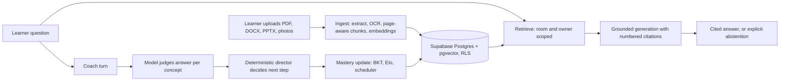

# Studigo: AI and software engineering tour

A guided map for someone who has ten minutes and wants to see the AI engineering and the software engineering methodology in this repo. Each claim points at the file that backs it, and each element says whether it is built, measured, or planned. Results are filled in as [the plan](PLAN.md) lands.

## The 30-second version

Studigo turns a student's own class materials into a course-specific tutor. The model writes and judges language. Deterministic code owns state, progression, and permissions. Offline evals decide whether a change ships.

That split is the main design idea. A tutor that lets the model decide what a learner has mastered is hard to test and easy to fool. Here the model produces questions, explanations, and per-concept judgments, and plain code turns those into mastery, scheduling, and the next challenge.

## How a request flows

## AI engineering elements

| Element | What it is | Where | Status |
| --- | --- | --- | --- |
| Permission-preserving RAG | Dense retrieval over pgvector (HNSW). The match function is `security invoker` and filters by owner and room, so one learner's chunks can never surface in another's answer. | `apps/web/lib/retrieval.ts`, `supabase/migrations/002_core_loop.sql` | Built, unmeasured |
| Grounded generation | The model answers only from numbered excerpts, cites inline, and returns an explicit "not in your materials" reply when evidence is missing. Teacher study guides outrank textbook text. | `packages/ai/src/grounding.ts` | Built. Citation check is marker-based; claim verifier planned (plan E7) |
| Retrieval query hygiene | Only the learner's raw question is embedded. Teaching style and other directives go to the system prompt, so they cannot dilute the search. | `apps/web/lib/engine.ts` | Built |
| Prompt-injection handling | Uploaded content is wrapped as untrusted data, and every prompt carries a rule to treat it as content, not instructions. The code comments say this is serialization, not a guarantee. | `packages/ai/src/client.ts` (`asUntrustedMaterial`, `UNTRUSTED_MATERIAL_RULE`) | Built. Injection eval scenario exists, results pending |
| Ingestion pipeline | Text extraction with page and slide numbers, OCR for scans and photos, page-accurate chunking, batched embeddings, and a topic map extracted from the teacher study guide. | `packages/documents/`, `apps/web/lib/ingest.ts`, `extractTopicMap` in `packages/ai/src/study.ts` | Built. Runs inside the request; durable worker planned (plan S4) |
| Structured outputs | Quiz questions, flashcards, topic maps, and grades come back as JSON-schema output, then get normalized and validated before use. | `structured()` and `normalizeGeneratedQuestion` in `packages/ai/src/study.ts` | Built |
| Coach: model judges, code decides | The model generates a question and scores the learner's answer per concept. `scoreConcepts` and `decideOutcome` turn that into an outcome with plain logic. | `packages/ai/src/coach.ts`, `apps/web/lib/coach-router.ts` | Built, unmeasured |
| Deterministic adaptive director | Chooses the next challenge and session plan from learner state and recent events. No model call, with a synthetic p95 latency gate of 50 ms. | `packages/learning/src/director.ts`, `apps/web/scripts/measure-director.ts` | Built. Synthetic measurement only |
| Learner modeling | Bayesian Knowledge Tracing, Elo, and a spaced-repetition scheduler as pure functions. Mastery comes from real practice; unpracticed topics count as zero. | `packages/mastery/src/` | Built |
| Offline knowledge-tracing eval | BKT against a recent-performance baseline, with fit/held-out separation by learner and cutoff time, and Brier, log loss, and calibration reporting. Synthetic data only. | `evals/ml/` | Built. Validates the harness, not learning effectiveness |
| Atomic evidence writes | Coach turns commit learning evidence through a transactional boundary designed so that a retried turn does not write evidence twice. | `apps/web/lib/learning/atomic-coach.ts`, `supabase/migrations/20261002010000_adaptive_coach_transactions.sql` | Built |
| Grading | Typo-tolerant fill-in grading is local and free; short answers use a model judge with defined score bands. | `apps/web/lib/grading.ts`, `packages/ai/src/typos.ts`, `gradeShortAnswer` | Built. Judge not yet calibrated against human labels |
| Provider isolation | One client with three transports (OpenAI direct, Vercel AI Gateway, local Ollama for chat). Embeddings never use Ollama because the vector column is 1536-dimensional. | `packages/ai/src/client.ts` | Built |
| RAG evaluation gate | 120 authored cases across scenarios including conflicting sources, edited and deleted revisions, cross-user and cross-room decoys, and injection. Scorer enforces zero unauthorized retrieval and 95% claim support and abstention. | `evals/rag/`, `docs/adr/001-adaptive-rag-benchmark.md` | Harness built. Cases pending review, no live results yet (plan E1 to E3) |

## Software engineering methodology

The AI parts sit inside a codebase with explicit rules. The rules are written down in [AGENTS.md](../AGENTS.md), and the table shows where each one shows up in practice.

**Principles**

- Grounded by default, and never fabricate citations or teacher requirements.
- Privacy is a database property (RLS), not an application convention.
- Provider calls live behind one package, so the rest of the code never touches a model SDK.
- Uploaded content is untrusted input.
- Prefer migrations over manual drift, typed interfaces over implicit shapes, and tests or evals around any behavior being changed.
- Do not add infrastructure because it is fashionable.

| Practice | What it looks like here | Where | Status |
| --- | --- | --- | --- |
| Package boundaries | `apps/web` for UI and routes, with `packages/ai` (provider and prompts), `documents` (extraction and chunking), `learning` (deterministic director), and `mastery` (BKT, Elo, scheduler) as separate typed packages. | `packages/`, `apps/web/` | Built. Boundary rule is a convention; no lint rule enforces it yet (plan H2) |
| Security tested against real migrations | A test runs the actual migrations in embedded Postgres with pgvector, switches roles, and checks that RLS, grants, and transactional functions behave. | `tests/database-security.test.mjs` | Built. Hosted Auth and Storage still need live verification |
| Trust boundaries in code | A user-scoped client proves ownership of a room. A separate server-only service client performs trusted writes, so browsers never hold privileges on trusted state. | `apps/web/app/api/chat/route.ts`, `apps/web/lib/supabase/` | Built |
| Idempotent, retry-safe work | Ingestion claims a document with a conditional update, so a double-click or racing retry cannot ingest it twice. Coach turns carry a client-generated interaction id. | `apps/web/lib/ingest.ts`, `apps/web/app/api/chat/route.ts` | Built |
| Feature flags and staged rollout | Risky paths ship behind flags, such as atomic Coach and the durable-session route, which stays off until its lifecycle is linked atomically. | `STUDIGO_ATOMIC_COACH`, `STUDIGO_ADAPTIVE_SESSION`, `STUDIGO_DURABLE_SESSIONS` | Built |
| Generated artifacts from one source of truth | Route policies are generated from the teaching knowledge base, not hand-copied into code. | `apps/web/scripts/generate-route-policies.ts`, `knowledge/teaching-coaching/` | Built |
| Decisions recorded | An ADR states what was chosen, what is provisional, and the numeric gates that would change the decision. | `docs/adr/001-adaptive-rag-benchmark.md` | Built |
| Docs with owners | A navigation index says which document owns product rules, architecture, status, release path, and evidence. | `docs/README.md` | Built. Volume is high; archiving and a read-first list planned (plan L4) |
| Evidence kept separate from claims | Beta evidence, execution evidence, and user test cases are their own documents, and the README lists known limits. | `docs/ADAPTIVE_BETA_EVIDENCE.md`, `docs/V3_EXECUTION_EVIDENCE.md`, `docs/USER_TEST_CASES.md` | Built |
| Branch and PR discipline | Substantial work goes through feature branches and PRs, with golden baselines treated as fixed reference points. | `AGENTS.md`, `docs/README.md` | Built |
| CI | Typecheck, unit tests, database security tests, RAG scorer tests, offline ML tests, and a production build run on every PR. | `.github/workflows/ci.yml` | Built. Lint is currently a no-op (plan H2) |

**Not yet where it should be:** lint failures are swallowed, the lockfile is not frozen in CI, the Playwright beta verification script is not run in CI, there is no coverage report, and the chat route has no rate limiting or tracing.

## Ten-minute demo path

1. **Upload a teacher study guide.** Show the topic map that appears, with each topic linked to its supporting passages.
2. **Ask a question it can answer.** Click a citation and show that it opens the learner's own file at the cited page.
3. **Ask something the materials do not cover.** Show the abstention instead of a made-up answer.
4. **Run a Coach turn with a partly right answer.** Show partial credit and a targeted nudge, then show mastery moving only because of real practice.
5. **Open `evals/rag` and the results table.** This is where to spend the most time once results exist: baseline, then each retrieval change, with latency and cost beside it.
6. **Show the engineering behind it.** Open `tests/database-security.test.mjs` to show RLS proven against the real migrations, then `AGENTS.md` and the ADR to show the rules and the decision gates.
7. **Close on limits.** Name what is unmeasured or planned. Saying it first is stronger than being asked.

## Questions to expect, and short answers

- **Why keep the model out of mastery decisions?** Judgments are noisy and hard to test. Deterministic state is unit-testable, auditable, and cheap to run.
- **Why keep TypeScript instead of moving retrieval to Python/LangChain?** The Python prototype used different embeddings, an unauthenticated index, and no authorization boundary, so comparing outputs would confound several variables. ADR 001 keeps TypeScript until a matched benchmark says otherwise.
- **How do you know answers are grounded?** Today: numbered excerpts, a strict prompt, and a marker check. Planned: a claim-level verifier scored against human labels, because a valid `[n]` does not prove support.
- **How do you handle prompt injection in uploads?** A data envelope plus an explicit rule in every prompt, and an eval scenario that plants instructions in an upload. It reduces risk; it is not a proof, and the run results are still pending.
- **How do you keep AI changes safe to ship?** Flags for risky paths, eval gates with numeric thresholds, and security tests that run the real migrations. A change that touches retrieval or grading is expected to come with an eval.
- **How is the code organized?** A thin app layer over four typed packages. Model calls live only in `packages/ai`, and mastery and progression live in packages with no model dependency.
- **What would you do next?** Hybrid retrieval and a reranker, shown by ablation on the reviewed corpus, then tracing and cost per turn.

## Known limits, stated plainly

- No committed live eval results yet; every RAG case is still pending review.
- Retrieval is dense top-k with an untuned similarity cutoff, no hybrid search or reranker.
- Citations are checked by marker, not by claim support.
- Ingestion runs inside the request, so very large scans can time out.
- No tracing, cost logging, or rate limiting on the chat route yet.
- Knowledge tracing is validated on synthetic data only.
- Not ready for open public use, mainly because of child-privacy, abuse, and cost controls. See the [security audit checklist](SECURITY_AUDIT_CHECKLIST.md).
