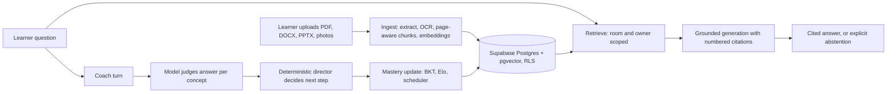

# Studigo: AI engineering tour

A guided map for someone who has ten minutes and wants to see the AI engineering in this repo. Each claim points at the file that backs it, and each element says whether it is built, measured, or planned. Results are filled in as [the measured-evidence plan](MEASURED_EVIDENCE_PLAN.md) lands.

## The 30-second version

Studigo turns a student's own class materials into a course-specific tutor. The model writes and judges language. Deterministic code owns state, progression, and permissions. Offline evals decide whether a change ships.

That split is the main design idea. A tutor that lets the model decide what a learner has mastered is hard to test and easy to fool. Here the model produces questions, explanations, and per-concept judgments, and plain code turns those into mastery, scheduling, and the next challenge.

## How a request flows

## AI engineering elements

| Element | What it is | Where | Status |
| --- | --- | --- | --- |
| Permission-preserving RAG | Dense retrieval over pgvector (HNSW). The match function is `security invoker` and filters by owner and room, so one learner's chunks can never surface in another's answer. | `apps/web/lib/retrieval.ts`, `supabase/migrations/002_core_loop.sql` | Built, unmeasured |
| Grounded generation | The model answers only from numbered excerpts, cites inline, and returns an explicit "not in your materials" reply when evidence is missing. Teacher study guides outrank textbook text. | `packages/ai/src/grounding.ts` | Built. Citation check is marker-based; claim verifier planned (plan step 7) |
| Retrieval query hygiene | Only the learner's raw question is embedded. Teaching style and other directives go to the system prompt, so they cannot dilute the search. | `apps/web/lib/engine.ts` | Built |
| Prompt-injection handling | Uploaded content is wrapped as untrusted data, and every prompt carries a rule to treat it as content, not instructions. The code comments say this is serialization, not a guarantee. | `packages/ai/src/client.ts` (`asUntrustedMaterial`, `UNTRUSTED_MATERIAL_RULE`) | Built. Injection eval scenario exists, results pending |
| Ingestion pipeline | Text extraction with page and slide numbers, OCR for scans and photos, page-accurate chunking, batched embeddings, and a topic map extracted from the teacher study guide. | `packages/documents/`, `apps/web/lib/ingest.ts`, `extractTopicMap` in `packages/ai/src/study.ts` | Built. Runs inside the request; durable worker planned (plan step 10) |
| Structured outputs | Quiz questions, flashcards, topic maps, and grades come back as JSON-schema output, then get normalized and validated before use. | `structured()` and `normalizeGeneratedQuestion` in `packages/ai/src/study.ts` | Built |
| Coach: model judges, code decides | The model generates a question and scores the learner's answer per concept. `scoreConcepts` and `decideOutcome` turn that into an outcome with plain logic. | `packages/ai/src/coach.ts`, `apps/web/lib/coach-router.ts` | Built, unmeasured |
| Deterministic adaptive director | Chooses the next challenge and session plan from learner state and recent events. No model call, with a synthetic p95 latency gate of 50 ms. | `packages/learning/src/director.ts`, `apps/web/scripts/measure-director.ts` | Built. Synthetic measurement only |
| Learner modeling | Bayesian Knowledge Tracing, Elo, and a spaced-repetition scheduler as pure functions. Mastery comes from real practice; unpracticed topics count as zero. | `packages/mastery/src/` | Built |
| Offline knowledge-tracing eval | BKT against a recent-performance baseline, with fit/held-out separation by learner and cutoff time, and Brier, log loss, and calibration reporting. Synthetic data only. | `evals/ml/` | Built. Validates the harness, not learning effectiveness |
| Atomic evidence writes | Coach turns commit learning evidence through a transactional boundary designed so that a retried turn does not write evidence twice. | `apps/web/lib/learning/atomic-coach.ts`, `supabase/migrations/20261002010000_adaptive_coach_transactions.sql` | Built |
| Grading | Typo-tolerant fill-in grading is local and free; short answers use a model judge with defined score bands. | `apps/web/lib/grading.ts`, `packages/ai/src/typos.ts`, `gradeShortAnswer` | Built. Judge not yet calibrated against human labels |
| Provider isolation | One client with three transports (OpenAI direct, Vercel AI Gateway, local Ollama for chat). Embeddings never use Ollama because the vector column is 1536-dimensional. | `packages/ai/src/client.ts` | Built |
| RAG evaluation gate | 120 authored cases across scenarios including conflicting sources, edited and deleted revisions, cross-user and cross-room decoys, and injection. Scorer enforces zero unauthorized retrieval and 95% claim support and abstention. | `evals/rag/`, `docs/adr/001-adaptive-rag-benchmark.md` | Harness built. Cases pending review, no live results yet (plan steps 1 to 3) |

## Ten-minute demo path

1. **Upload a teacher study guide.** Show the topic map that appears, with each topic linked to its supporting passages.
2. **Ask a question it can answer.** Click a citation and show that it opens the learner's own file at the cited page.
3. **Ask something the materials do not cover.** Show the abstention instead of a made-up answer.
4. **Run a Coach turn with a partly right answer.** Show partial credit and a targeted nudge, then show mastery moving only because of real practice.
5. **Open `evals/rag` and the results table.** This is where to spend the most time once results exist: baseline, then each retrieval change, with latency and cost beside it.
6. **Close on limits.** Name what is unmeasured or planned. Saying it first is stronger than being asked.

## Questions to expect, and short answers

- **Why keep the model out of mastery decisions?** Judgments are noisy and hard to test. Deterministic state is unit-testable, auditable, and cheap to run.
- **Why keep TypeScript instead of moving retrieval to Python/LangChain?** The Python prototype used different embeddings, an unauthenticated index, and no authorization boundary, so comparing outputs would confound several variables. ADR 001 keeps TypeScript until a matched benchmark says otherwise.
- **How do you know answers are grounded?** Today: numbered excerpts, a strict prompt, and a marker check. Planned: a claim-level verifier scored against human labels, because a valid `[n]` does not prove support.
- **How do you handle prompt injection in uploads?** A data envelope plus an explicit rule in every prompt, and an eval scenario that plants instructions in an upload. It reduces risk; it is not a proof, and the run results are still pending.
- **What would you do next?** Hybrid retrieval and a reranker, shown by ablation on the reviewed corpus, then tracing and cost per turn.

## Known limits, stated plainly

- No committed live eval results yet; every RAG case is still pending review.
- Retrieval is dense top-k with an untuned similarity cutoff, no hybrid search or reranker.
- Citations are checked by marker, not by claim support.
- Ingestion runs inside the request, so very large scans can time out.
- No tracing, cost logging, or rate limiting on the chat route yet.
- Knowledge tracing is validated on synthetic data only.
